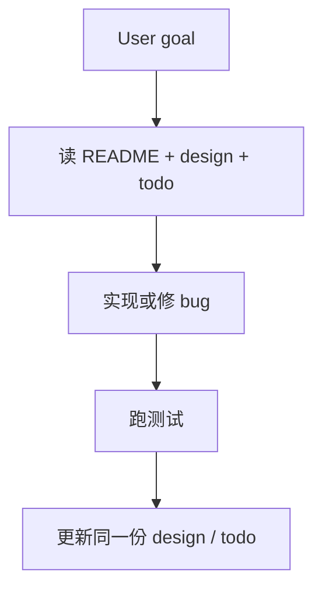

# Compass

> [Changelog](CHANGELOG.md) · [Version](VERSION)

**本分支是 Compass simplify：**面向 AI coding Agent 的 project-local 规则和可选 CLI worker。不维护 L1–L5，不安装 Compass Skill。

项目知识只留在仓库里的一份文档：

| 文件 | 职责 |
|:-----|:-----|
| 根 `README.md` | 项目是什么、怎么跑、模块怎么切 |
| `doc/<feature>_design.md` | 每个大功能模块一份 design，只此一份 |
| `doc/todo.md` | 当前要做的事 |

Compass 把这些约定写进所选平台的 `AGENTS.md` / `CLAUDE.md`。本机若能调用 Claude Code CLI，planner 上的 hook 把正要做的 implementation 交给 `claude`。完整五层 + Skill + SDD 仍在 `main`。

## 如何工作

用户用自然语言描述目标。Agent 先读 README、相关 design 和 todo，再改代码、跑测试；行为变了只更新对应那份 design，任务变了只更新 `doc/todo.md`。



没有 Compass Skill 入口。不要另写 `.compass/context/` 里的项目描述，不要创建 Spec / proposal / L1–L5。

Commit 和 push 仍是 Agent 通用能力，只有用户明确要求时才执行。

## 安装到 project

### 1. 复制 package

```bash
cp -R /path/to/project-compass/compass /path/to/projectA/.compass
```

目标 project 已有 `.compass/` 时不要覆盖；按其中 `INSTALL.md` 的 migration rule 处理。

### 2. 让 Agent 安装

> 请阅读 `.compass/INSTALL.md`，为当前 project 安装 Cursor 版 Compass；保留已有 project file，并报告所有 conflict。

需要多个 platform 时一次写明。没写 platform 时 installer 只问一次。

Agent 会：

1. 检查 repository 和 Git status；
2. **不**填写 L1–L5，也 **不**安装 Compass Skill；
3. 把 Compass 的 marked rule block（含 Project Knowledge 约定）合并进所选 platform 的 native instruction file；
4. 判定本机能否调用 Claude Code CLI，写入 `.compass/context/cli-worker.md`；`enabled` 时安装 planner hook；
5. 把 `/.compass/` 以及已选 platform 的 instruction、Subagent 和 hook 写入 local `info/exclude`（**不** exclude `README.md` 或 `doc/`）；
6. 报告 created / skipped / conflict，以及 README / `doc/` 是否已存在。

缺失的 README、design 或 todo 由后续工作按 `AGENTS.md` 补齐，安装器不编造产品文档。

## 安装后的文件

安装完成后，`.compass/` 只保留 `context/cli-worker.md`。

| Platform | Project instruction | Compass Skill | CLI worker hook |
|:---------|:--------------------|:--------------|:----------------|
| Codex | `AGENTS.md` | 不安装 | `.codex/hooks.json` + `.codex/hooks/cli-worker.py`（仅 enabled） |
| Cursor | `AGENTS.md` | 不安装 | `.cursor/hooks.json` + `.cursor/hooks/cli-worker.py`（仅 enabled） |
| OpenCode | `AGENTS.md` | 不安装 | `.opencode/plugins/compass-cli-worker.js` + `.opencode/hooks/cli-worker.py`（仅 enabled） |
| Claude Code | `CLAUDE.md` | 不安装 | 不安装（当前进程就是 worker） |

Optional `codebase-explorer` 只有用户明确要求时才安装。

## Copyable package

```text
compass/
├── AGENTS.md       带 marker 的规则：Project Knowledge + 开发/测试/review
├── INSTALL.md      non-destructive installation
├── context/        仅 cli-worker 判定
├── subagents/      optional explorer contract
├── hooks/          CLI worker hook source
└── platforms/      Codex、Cursor、Claude Code、OpenCode installer
```

## 安全与维护

- Installation 只合并 marked block，保留 marker 外的 existing content。
- 不覆盖根 `README.md` 或 `doc/`。
- `.compass/` 与平台 Compass artifact 只写入 local Git exclude，不 exclude 项目文档。
- 不安装 Compass Skill，不创建 Skill symlink。

## License

MIT License
