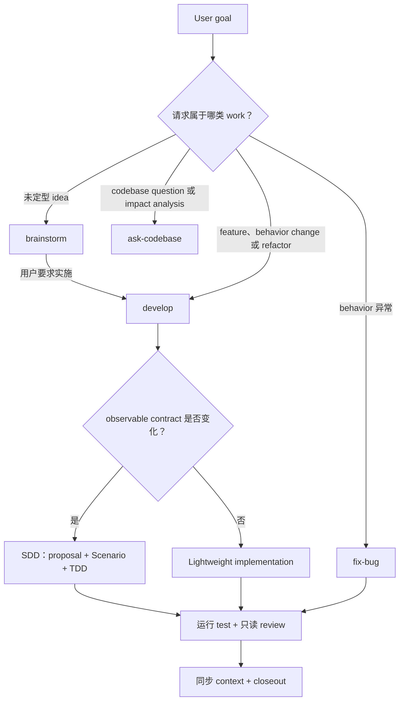

# Compass

> [Changelog](CHANGELOG.md) · [Version](VERSION)

**面向 AI coding Agent 的 project-local operating layer。**

Compass 把普通 repository 变成 **Codex**、**Claude Code** 和 **OpenCode** 能够持续理解、修改并验证的工作环境。只需把一个 directory 复制进 project，Agent 就会安装 project rule、构建持久的 L1–L5 context、暴露 goal-oriented Skill，并为 behavior change 配置只读 reviewer。

Compass 要解决的问题，不是 Agent 会不会写 code，而是它能否持续工作：不反复重新发现 codebase，不为每个 task 临时发明一套 Workflow，不在 session 之间丢失 project rule，也不把一份绿色 test summary 当成充分 evidence。

Compass 把这些工作知识留在 project 内：

- **Context 可持续：**architecture、constraint、Spec、session state 和 validation evidence 都位于 `.compass/context/`。
- **用户只表达 goal：**开发 feature、修复 bug、调查 code 和审计 test 是 entry point；review、context sync 和 archive 是内部 stage。
- **Workflow 匹配 change：**observable contract change 使用 SDD + TDD；不改变 behavior 的工作走 lightweight path。
- **Ownership 清晰：**Main Agent 是唯一 writer；内置 `sdd-reviewer` 只读提供 independent evidence。
- **Installation 保持 project-local：**不依赖 CLI，不安装 global Skill，也不创建 Skill symlink。

## 如何工作

用户描述想得到的 outcome。对于日常 product work，Compass 按下面的主线完成 routing 和内部 handoff：



一次正常的 `develop` 会自动推进 plan、implementation、test、review、context sync 和 closeout，不要求用户串联 Workflow command。真正的 product decision 和 permission boundary 仍会交还用户；内部 state transition 不会打扰用户。

Compass 不会因为 Workflow 结束就自动 commit 或 push。它们仍是 Agent 的 general capability，只有用户明确要求时才执行。

## 安装到 project

### 1. 复制 package

从 Compass source checkout 中，把现有 [`compass/`](compass/) 复制到目标 project root，并命名为 `.compass/`：

```bash
cp -R /path/to/project-compass/compass /path/to/projectA/.compass
```

这条 command 只用于首次 installation。如果目标 project 已经存在 `.compass/`，不要覆盖；先比较现有 installation，并按照其中 `INSTALL.md` 的 migration rule 处理。

### 2. 让 Agent 安装

用准备启用的 Agent 打开目标 project，然后说，例如：

> 请阅读 `.compass/INSTALL.md`，为当前 project 安装 Codex 版 Compass；保留已有 project file，并报告所有 conflict。

需要多个 platform 时一次写明全部 platform。如果 request 没有说明 platform，Agent 也无法安全推断，installer 只会集中询问一次。

Agent 会：

1. 写入前检查 repository、existing instruction 和 Git status；
2. 在 `.compass/context/` 中填写最小且有用的 project context；
3. 把 Compass 的 marked rule block 合并进所选 platform 的 native instruction file；
4. 从 installation staging 的 `.compass/skills/` 把全部 9 个 Skill 复制到 platform 的 project-level Skill directory；
5. 安装只读 `sdd-reviewer`，或记录 inline fallback；
6. 把 `/.compass/` 以及已选 platform 的 `AGENTS.md` / `CLAUDE.md`、Compass Skill 和 Subagent 精确 path 全部写入 repository-local `.git/info/exclude` 受管区块；
7. 验证结果并报告 created、updated、skipped 和 conflicting file。

Local exclude 不会修改团队共享的 `.gitignore`，也不会隐藏已经 tracked 的文件。已选 platform 的 `AGENTS.md` 或 `CLAUDE.md` 无论是新建还是 merge existing content，installer 都会写入 local exclude；如果它已 tracked，最终报告会明确说明该 pattern 已写入但 Git 仍会显示文件变更。

如果 installation report 提示 Skill discovery 需要刷新，请新建 Agent session 后再开始使用。

## 使用 Compass

直接用 natural language 提出 request 即可；下表中的 Skill name 用来说明 routing model。

| User goal | Entry point | Request 示例 |
|:----------|:------------|:-------------|
| 从零创建 project | `init-project` | “创建一个使用 PostgreSQL 的轻量 issue tracker。” |
| 为已有 codebase 构建或修复 context | `build-context` | “为这个 repository 构建 Compass context。” |
| 实施前梳理 idea | `brainstorm` | “帮我想清楚 offline mode 应该怎么设计。” |
| 开发 feature、调整 behavior 或 refactor | `develop` | “给 report page 增加 export filter。” |
| 诊断并修复一个 bug 或 failing test | `fix-bug` | “修复 webhook 重复投递。” |
| 定位 code、解释 architecture 或分析 impact | `ask-codebase` | “authorization 在哪里执行，谁会调用它？” |
| 专项审计 test coverage 与 trustworthiness | `audit-tests` | “检查 checkout test 会不会 false-pass。” |
| 持续迭代到 objective check 通过 | `ralph-loop` | “使用 Ralph Loop，直到 migration test 通过。” |
| 创建或修订 project-local Skill | `skill-creator` | “合并这两个职责重叠的 project Skill。” |

前 7 个是常用 goal-oriented capability。`ralph-loop` 和 `skill-creator` 是显式 meta capability：只有 request 明确需要 persistent iteration 或 Skill authoring 时才会运行。普通 code review 仍是 Agent 的基础能力，直接要求 review 即可；`audit-tests` 用于 test quality 专项评估，不替代普通 review。

更详细的 routing、SDD/lightweight 分流、quality invariant 和 Skill 合并理由见 [Workflow Analysis](docs/workflow-analysis.md)。

## Project context

Compass context 不是 document dump。每一层回答不同问题，并且只写入由 source code、configuration、test 或已确认 requirement 支持的 fact。

| Layer | 回答的问题 | 常见 content |
|:------|:-----------|:-------------|
| **L1 — Codebase Map** | 在哪里，如何连接？ | feature map、architecture、entry point、dependency |
| **L2 — Rules** | change 必须遵守什么 constraint？ | coding rule、module boundary、真实 test command |
| **L3 — Specs** | 预期或正在改变什么 behavior？ | system requirement、capability Spec、active change |
| **L4 — Session** | 哪些 work 需要跨 session 恢复？ | 当前 state、decision、下一项已验证 action |
| **L5 — Validation** | 哪些内容真正核实过？ | Scenario traceability、test design、review evidence |

Project 不需要填满所有 optional file。先建立最小可用 context，只在 navigation、change management 或 verification 确实需要时继续深入。准确的 minimum set 和 layer rule 见 [`compass/context/README.md`](compass/context/README.md)。

## 安装后的文件

安装完成后，`.compass/` 只保留 `context/`。各 platform 的 native Skill 是不附加 marker、README 或 manifest 的 plain copy；同名 Skill 内容完全一致时复用，内容不同时 installer 保留 existing file 并报告 conflict。Subagent 仍使用文件内的 generated marker 支持安全更新与移除。

| Platform | Project instruction | Installed Skill | Read-only reviewer |
|:---------|:--------------------|:----------------|:-------------------|
| Codex | `AGENTS.md` | `.agents/skills/` | `.codex/agents/sdd-reviewer.toml` |
| Claude Code | `CLAUDE.md` | `.claude/skills/` | `.claude/agents/sdd-reviewer.md` |
| OpenCode | `AGENTS.md` | `.opencode/skills/` | `.opencode/agents/sdd-reviewer.md` |

同时选择 Codex 和 OpenCode 时，两者复用 root `AGENTS.md` 中同一个 marked block。Optional `codebase-explorer` 只有用户明确要求时才安装。

Git 项目中，上表实际安装的根 instruction、每个 Compass Skill 和每个 generated Subagent 会连同 `/.compass/` 写入 local `info/exclude`。Installer 只写具体 Skill/Subagent path，不会整体 ignore `.agents/`、`.claude/`、`.codex/` 或 `.opencode/`。

## Copyable package

目标 project 只需要 [`compass/`](compass/)：

```text
compass/
├── AGENTS.md       带 marker 的 project-rule baseline
├── INSTALL.md      non-destructive installation 与 migration contract
├── context/        原地填写的 L1–L5 project context
├── skills/         9 个 Skill 的 installation source
├── subagents/      built-in reviewer 与 optional explorer contract
└── platforms/      Codex、Claude Code、OpenCode installer 与 template
```

Repository root 的 [`docs/`](docs/) 是 maintainer material，刻意不包含在复制给目标 project 的 package 中。Release 和 compatibility change 见 [Changelog](CHANGELOG.md)。

## 安全与维护

- Installation 只合并 marked block，并保留 marker 外的 existing content。
- `.compass/` 与已选 platform 的全部 Compass 文档和 artifact 只写入 repository-local Git exclude，不修改 shared `.gitignore` 或 tracked-file index flag。
- 不覆盖内容不同的同名 Skill，也不覆盖没有 generated marker 的同名 Subagent。
- 不修改 global Skill directory，也不创建 Skill symlink。
- Skill copy 不附加 ownership marker 或其他 installer metadata；后续更新需要重新取得 Compass installation source，内容不同时先报告 conflict。
- 把 `.compass/context/` 视为 project knowledge；uninstall 时默认保留，除非用户明确要求删除。

## License

MIT License
