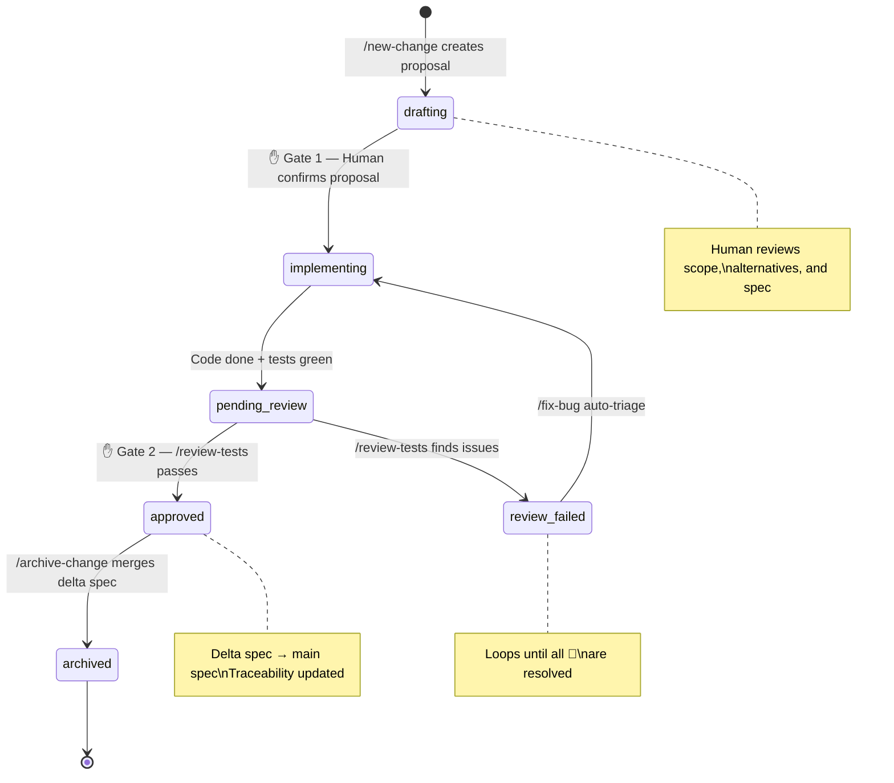
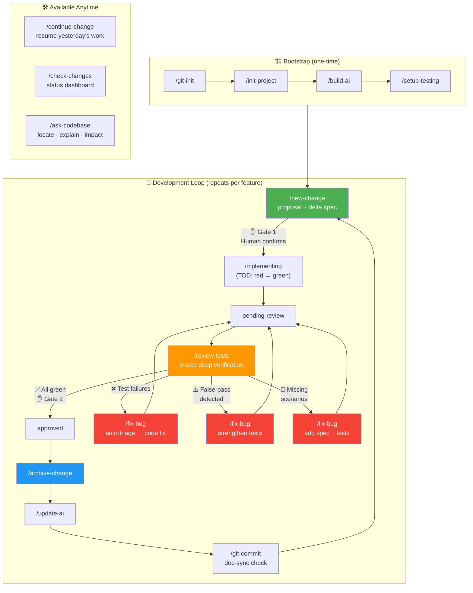
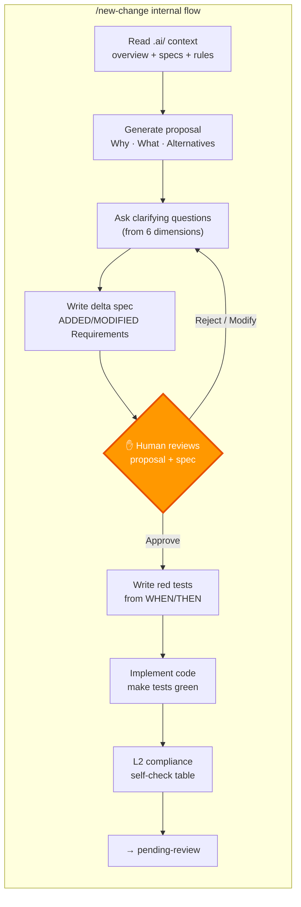
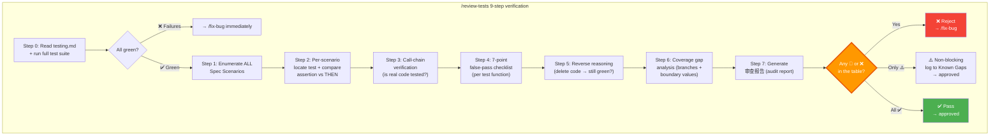

# Project Compass

> **[中文版 / Chinese Version](README.zh.md)** · Version: see [VERSION](VERSION) · [CHANGELOG](CHANGELOG.md)

> Universal AI context template — works with any language, any framework, any scale.
> Copy this template to your project root (rename to `.ai/`), fill in the `[fill in]` placeholders.

## Core Philosophy

AI context windows are limited. For any codebase of meaningful size, you can't fit everything into context.
You need a **layered, on-demand loading** context management system so AI can, in every conversation:

1. **Pinpoint** — Know which files to look at for a given task (feature → code mapping)
2. **Follow rules** — Know how to write and what not to do (rules + anti-patterns)
3. **Understand goals** — Know the current objective (spec-driven requirements)
4. **Continue progress** — Know where the last step left off and what to do next (session layer)
5. **Validate** — Verify that implementation matches spec (traceability + test design)

### Design Principles

- **Only write what AI can't infer** — Directory structure, tech stack, module responsibilities — AI can figure these out via `tree` + `grep`, not worth documenting
- **Task-oriented indexing** — Documentation should help AI locate "which code to look at", not describe "what the code looks like"
- **Relationships > Descriptions** — File coupling and change propagation are 100x more useful than file listings
- **Progressive disclosure** — AI loads only the minimum context needed for the current task, never filling the entire window at once
- **Verifiable > Abstract** — "Domain layer must not import Infrastructure layer" is more useful than "uses Clean Architecture"

### L1 Navigation Model

AI reads **only `overview.md`** (< 60 lines) per conversation, then selects a path based on task type:

```
Receive task
 ├─ Matches a specific feature → features/[name]/README.md → drill into layer files as needed
 ├─ Common dev tasks → key-files.md (task recipes)
 ├─ Changes span multiple modules → module-map.md (change propagation table)
 └─ Modifying infrastructure → infrastructure/README.md
```

Paths are composable — e.g., cross-feature changes load both feature README + module-map.
Every target file has **bidirectional links** (source / related files) to prevent AI from getting lost.

## Five-Layer Architecture

```
.ai/
├── L1-codebase-map/          ← Code navigation layer (stable, low-frequency updates)
│   ├── overview.md           ← Single entry point (< 60 lines, feature index + routing decision tree)
│   ├── module-map.md         ← Module contracts & coupling map (loaded for cross-module changes)
│   ├── key-files.md          ← Common task recipes & investigation starting points
│   ├── architecture.md       ← Runtime architecture (deployment topology, request lifecycle, middleware pipeline)
│   ├── infrastructure/       ← Infrastructure docs (framework/middleware/utilities, peer to features)
│   │   ├── _infrastructure-template/ ← Infrastructure component doc template
│   │   │   └── README.md         ← Component overview + layer nav + format reference
│   │   └── [component-name]/     ← One folder per infrastructure component
│   │       ├── README.md         ← Component overview (must read)
│   │       └── [layer].md        ← Layer files (loaded on demand)
│   └── features/             ← Per-feature detailed context (progressive disclosure)
│       ├── _feature-template/   ← Feature doc template (copy to create new feature)
│       │   └── README.md        ← Overview + layered nav + data flow + layer file format reference
│       └── [feature-name]/      ← One folder per feature
│           ├── README.md        ← Feature overview (must read)
│           └── [layer].md       ← Layer files (dynamically named by project concepts, loaded on demand)
│
├── L2-rules/                 ← Rules layer (stable, sharded by domain)
│   ├── global.md             ← Global rules (concrete executable rules + anti-pattern checklist)
│   ├── templates.md          ← Code templates for new files (loaded when creating files)
│   ├── _module-template.md   ← Module rules template (contracts + pitfalls + boundaries)
│   └── [module-name].md      ← Created per actual project module
│
├── L3-specs/                 ← Spec-driven requirements & change management layer
│   ├── specs/                ← Living system specifications (TOR → HLR hierarchy)
│   │   ├── system.md         ← Top-Level Requirements (TOR): system boundary & cross-cutting concerns
│   │   ├── _capability-template/ ← Capability spec template
│   │   └── <domain>/spec.md  ← High-Level Requirements (HLR) per capability domain (nestable)
│   ├── changes/              ← In-progress changes (filesystem = status)
│   │   ├── _change-template/ ← Change template (proposal + delta spec + tasks)
│   │   └── <name>/           ← One folder per change
│   │       ├── proposal.md   ← Why + what + alternatives + decision rationale
│   │       ├── specs/<cap>/spec.md ← Delta spec (ADDED/MODIFIED/REMOVED requirements)
│   │       └── tasks.md      ← Implementation checklist (checkbox format)
│   └── archive/              ← Completed changes (with review status in proposal.md)
│
├── L4-session/               ← Session layer (high-frequency changes, maintained per conversation)
│   └── active-session.md     ← Current session state (test status + next actions)
│
├── L5-validation/            ← Validation layer (spec-to-code traceability & test design)
│   ├── validation-rules.md   ← Validation rules reference (how AI performs verification)
│   ├── traceability/         ← Traceability matrices (spec ↔ code ↔ test mapping)
│   │   ├── _domain-template.md ← Traceability template
│   │   └── <domain>.md       ← One file per capability domain
│   ├── test-specs/           ← Test case designs (expanded from L3 Scenarios)
│   │   ├── _domain-template.md ← Test spec template
│   │   └── <domain>.md       ← Concrete test cases (input/expected/edge cases)
│   └── reports/              ← Validation reports (timestamped snapshots)
│       └── <date>-<scope>.md ← Verification results + gap analysis
│
├── builders/                  ← Auto-generation prompt collection (organized by tool)
│   ├── cline/               ← Cline-specific (subagent read-only, outputs text for main agent to write)
│   │   ├── sub-agent/        ← Sub-agent variant (default): subagents analyze features in parallel
│   │   │   ├── prompt-L1a.md ← Generate L1 docs Phase 1-3 (scan + overview; infra-first discovery)
│   │   │   ├── prompt-L1b.md ← Generate L1 docs Phase 4-5 (4a: infra docs → 4b: subagent feature analysis)
│   │   │   ├── prompt-L2.md  ← Generate L2 coding rules
│   │   │   ├── prompt-L3.md  ← Build initial L3 specs from existing code
│   │   │   └── prompt-L5.md  ← Build L5 validation traceability & test specs
│   │   └── single-agent/     ← Single-agent variant: no subagents, pause for human review after each item
│   │       ├── README.md     ← Mode comparison & usage guide
│   │       ├── prompt-L1a.md
│   │       ├── prompt-L1b.md ← Core difference: main agent analyzes each feature/infra one at a time
│   │       ├── prompt-L2.md  ← Pauses for review after each module
│   │       ├── prompt-L3.md
│   │       └── prompt-L5.md
│   └── claude/              ← Claude Code-specific (subagent has read+write, creates files directly)
│       ├── prompt-L1a.md     ← Generate L1 docs Phase 1-3 (scan + overview; infra-first discovery)
│       ├── prompt-L1b.md     ← Generate L1 docs Phase 4-5 (4a: infra docs → 4b: subagent feature analysis)
│       ├── prompt-L2.md
│       ├── prompt-L3.md      ← Build initial L3 specs from existing code
│       └── prompt-L5.md      ← Build L5 validation traceability & test specs
├── .github/skills/            ← Copilot custom skills (auto-invoked by keyword)
│   ├── git-init/SKILL.md          ← Initialize a new git repository (keyword: init git, new repo)
│   ├── init-project/SKILL.md      ← Bootstrap a new project from scratch (keyword: 新项目, init project, 从零开始)
│   ├── build-ai/SKILL.md          ← Build .ai context from scratch (keyword: init .ai, build ai docs)
│   ├── update-ai/SKILL.md         ← Update existing .ai context (keyword: refresh .ai, update ai docs)
│   ├── setup-testing/SKILL.md     ← Set up / update testing conventions (keyword: testing rules, 测试规范)
│   ├── new-change/SKILL.md        ← Create new change with spec-driven workflow (keyword: new feature, 新需求)
│   ├── continue-change/SKILL.md   ← Resume an in-progress change from last session (keyword: 继续开发, continue)
│   ├── check-changes/SKILL.md     ← Show status of all in-progress changes (keyword: change status, 变更状态)
│   ├── review-tests/SKILL.md      ← Run tests + coverage audit + false-pass hunting (keyword: review tests, 虚假通过)
│   ├── fix-bug/SKILL.md           ← Unified bug-fix entry with automatic triage (keyword: bug, fix issue, review failed, 虚假通过)
│   ├── ask-codebase/SKILL.md      ← Answer questions: locate features, explain architecture, analyze impact (keyword: 在哪, where is, 影响分析)
│   ├── archive-change/SKILL.md    ← Archive a completed change, merge delta spec (keyword: 归档, archive)
│   └── git-commit/SKILL.md        ← Stage/commit/push with conventional message + doc-sync check (keyword: commit, push)
├── entrypoints/              ← AI tool entry point templates
│   ├── clinerules.md         ← Cline entry template (→ .clinerules)
│   ├── claude.md             ← Claude Code entry template (→ CLAUDE.md)
│   ├── copilot-instructions.md ← GitHub Copilot entry template
│   ├── change-management.md  ← Change management workflow reference (→ .ai/L3-specs/)
│   └── doc-sync.md           ← Doc sync workflow reference (→ .ai/doc-sync.md)
├── roadmap/                  ← Product roadmap & research
│   ├── README.md             ← Prioritized roadmap organized by level
│   └── multi-agent-collaboration-research.md ← Multi-agent collaboration research
└── README.md                 ← This file
```

## L1 vs L2 — What's the Difference?

> **In one sentence: L1 = Map (where things are, how to navigate), L2 = Rules (how to write, what's allowed)**

An analogy:
- **L1** = City map → "The hospital is here, the school is there, take this road from home to hospital"
- **L2** = Traffic rules → "Drive on the right, red means stop, speed limit 60"

### Comparison

| Question | L1 answers | L2 answers |
|----------|-----------|-----------|
| "Where's the login code?" | ✅ `src/auth/` directory, entry at `routes/auth.ts` | — |
| "What breaks if I change User table?" | ✅ Must also update JWTPayload type | — |
| "What's the full request data flow?" | ✅ route → controller → service → repo → response | — |
| "What naming convention to use?" | — | ✅ Files kebab-case, functions camelCase |
| "What should a new Service file look like?" | — | ✅ Standard code template available |
| "How to handle errors?" | — | ✅ Service layer throws AppError, Controller doesn't try-catch |
| "Which module APIs are stable?" | — | ✅ `authenticate()` is STABLE, `validatePassword()` is INTERNAL |
| "Any gotchas in this feature?" | ✅ Async callback has race condition | — |

### File Mapping

```
L1 features/user-auth/              L2 rules/
├── README.md    → Data flow + change impact    ├── global.md     → Global coding standards
├── routes.md    → Endpoints, param structure    ├── templates.md  → Code templates for new files
├── services.md  → Business rules, state flow   └── auth.md       → auth module contracts + constraints
└── models.md    → Table schema, queries, migrations
     ↑                                              ↑
     Map: where code lives, how data flows          Rules: how to write code, what contracts exist
```

> Note: Layer file names (e.g., routes.md, services.md) are not fixed — they're dynamically named by subagents based on actual code structure.

### When Information Relates to Both

| Information | Goes in | Reasoning |
|-------------|---------|-----------|
| "Token refresh has race condition during login" | L1 | Related to feature data flow |
| "`authenticate()` is stable API, can't change signature" | L2 | Module contract / coding constraint |
| "Changing User model requires updating DTO" | L1 | Change impact (change A → must change B) |
| "All DB operations must use transactions" | L2 | Coding rule (how to write) |
| "Payment callback is async" | L1 | Data flow characteristic |
| "New auth methods must implement AuthStrategy interface" | L2 | Coding constraint (pattern to follow) |

## Quick Start

### Step 1: Copy template to your project

```bash
# Copy the entire project-compass into your project's .ai/ directory
cp -r /path/to/project-compass /path/to/your-project/.ai/
```

### Step 2: Build L1 → L2 → L3 using builder prompts

Choose the builder matching your AI tool, then run prompts **in order**:

- **Claude Code** → `builders/claude/`
- **Cline (sub-agent mode)** → `builders/cline/sub-agent/` — subagents analyze features in parallel, efficient for large projects
- **Cline (single-agent mode)** → `builders/cline/single-agent/` — main agent analyzes one by one, pauses for human review after each item

| Order | Builder Prompt | What it builds | External input |
|-------|---------------|----------------|----------------|
| 1 | `prompt-L1a.md` | overview.md + feature list + `_handoff.md` | Optional: supplementary context file |
| 2 | `prompt-L1b.md` | features/ docs + architecture.md + module-map.md + key-files.md | Reads `_handoff.md` from step 1 |
| 3 | `prompt-L2.md` | global.md + templates.md + module rules | Reads L1 output |
| 4 | `prompt-L3.md` | system.md (TOR) + capability specs (HLR) | Optional: PRD / product spec / API docs |
| 5 | `prompt-L5.md` | traceability matrices + test specs + validation report | Reads L1 + L3 output |

> Each prompt is a self-contained instruction. Copy it into a new conversation with the AI, fill in the `[placeholders]`, and let the AI execute.

### Step 3: Deploy entrypoint

Copy the matching entrypoint template to your project root:

| AI Tool | Source | Target |
|---------|--------|--------|
| Claude Code | `.ai/entrypoints/claude.md` | `CLAUDE.md` in project root (if `CLAUDE.md` already exists, append the content) |
| Cline | `.ai/entrypoints/clinerules.md` | `.clinerules` in project root |
| GitHub Copilot | `.ai/entrypoints/copilot-instructions.md` | `.github/copilot-instructions.md` |

After this, every AI conversation will auto-load `.ai/` context and self-navigate.

## Loading Strategy

### Always Load (Prompt Preamble)
- `L1-codebase-map/overview.md` — Lightweight index (< 60 lines, feature directory + danger zones)
- `L4-session/active-session.md` — Current session state (with next actions)
- `L2-rules/global.md` — Global rules (with anti-pattern checklist)

### Load On Demand After Receiving Task (Progressive Disclosure)
- `L1-codebase-map/features/[name]/README.md` — **Loaded after matching feature from overview.md index, drill into layer files as needed**
- `L1-codebase-map/key-files.md` — For common dev tasks (adding endpoints, tables, fixing bugs)
- `L1-codebase-map/module-map.md` — For cross-module changes (check change propagation table)
- `L1-codebase-map/architecture.md` — For understanding runtime behavior, request lifecycle, or cross-layer issues
- `L2-rules/[module-name].md` — For specific module tasks (check contracts and pitfalls)
- `L2-rules/templates.md` — When creating new files (check standard code templates)
- `L3-specs/specs/system.md` — System-level requirements (TOR)
- `L3-specs/changes/` — View in-progress changes
- `L3-specs/change-management.md` — When creating or archiving changes (detailed workflow)
- `L5-validation/validation-rules.md` — When validating spec-to-code traceability
- `L5-validation/traceability/<domain>.md` — When checking implementation coverage
- `L5-validation/test-specs/<domain>.md` — When designing or generating tests

### Occasional Reference
- `L3-specs/archive/` — When asking "why was this done this way?" (check proposal.md)
- `L3-specs/specs/<domain>/spec.md` — When checking existing requirements

## Workflow (Mode B: AI Self-Navigation)

> Recommended: Place an entry point file in project root. AI reads `.ai/` docs automatically and self-navigates throughout.

```
┌─────────────────────────────────────────────────────────┐
│  Step 0 (One-time setup)                                │
│  Copy template from entrypoints/ → project root entry   │
│  (.clinerules / CLAUDE.md / copilot-instructions etc.)  │
└─────────────────────────────────────────────────────────┘
                            ↓
┌─────────────────────────────────────────────────────────┐
│  Step 1-2 (Auto, every conversation)                    │
│  AI reads entry file → auto-loads:                      │
│    • overview.md      — Project feature index           │
│    • global.md        — Global coding rules             │
│    • active-session.md — Last progress + next steps     │
└─────────────────────────────────────────────────────────┘
                            ↓
┌─────────────────────────────────────────────────────────┐
│  Step 3  User gives task                                │
│  "Fix the token refresh bug in user login"              │
└─────────────────────────────────────────────────────────┘
                            ↓
┌─────────────────────────────────────────────────────────┐
│  Step 4  AI locates feature by index                    │
│  overview.md feature index → match "user auth"          │
│  → read features/user-auth/README.md                    │
│  → drill into layer files as needed                     │
└─────────────────────────────────────────────────────────┘
                            ↓
┌─────────────────────────────────────────────────────────┐
│  Step 5  AI reads module rules                          │
│  → read L2-rules/auth.md (contracts + constraints)      │
└─────────────────────────────────────────────────────────┘
                            ↓
┌─────────────────────────────────────────────────────────┐
│  Step 6  AI manages changes                             │
│  → check changes/ / create proposal + delta spec + tasks│
│  → write plan + verification questions → await human OK │
└─────────────────────────────────────────────────────────┘
                            ↓
┌─────────────────────────────────────────────────────────┐
│  Step 7  AI writes code                                 │
│  Follow global.md + module rules, reference templates   │
│  Check module-map.md before cross-module changes        │
└─────────────────────────────────────────────────────────┘
                            ↓
┌─────────────────────────────────────────────────────────┐
│  Step 8  AI updates session state                       │
│  → update active-session.md                             │
│    • What was done, which files were involved           │
│    • Test results, specific next actions                │
└─────────────────────────────────────────────────────────┘
```

**Key point:** Human only does Step 0 (once) + Step 3 (give task). Everything else is autonomous.

## What Each Document Should Contain (Guide)

| Document | ✅ Should write | ❌ Don't write (AI can infer) |
|----------|----------------|------------------------------|
| overview.md | **Feature index table** (name + pointer), **dependency overview** (feature → infrastructure direction), danger zones, build commands | Data flow details, file listings (goes in features/[name]/) |
| module-map.md | **Dependency topology** (ASCII global layer diagram), public API list, change propagation table, dependency prohibition rules | Module responsibility descriptions, LOC stats |
| key-files.md | Common task recipes, investigation starting points, global change impacts | Feature-specific recipes (goes in features/[name]/) |
| features/[name]/ | Complete context for one feature, split by layer: README (overview + data flow + **infrastructure dependencies**), controller/service/data (layer details) | Cross-feature generic info |
| global.md | Concrete executable rules, anti-pattern checklist, error handling patterns | "Architecture pattern: Clean Architecture" (too abstract) |
| templates.md | Code templates for new files (Service, Test, etc.) | Should be extracted from actual code, not fabricated |
| Module rules | Public contracts (function signatures + stability), internal coding constraints, boundary rules, test strategy | Data flows, file lists, change impact (goes in L1) |
| specs/system.md | System boundary, cross-cutting requirements (TOR) | Feature-specific requirements (goes in domain spec) |
| specs/<domain>/spec.md | Capability requirements with WHEN/THEN scenarios (HLR) | Implementation details (goes in change tasks) |
| changes/<name>/ | proposal (why + decision) + delta spec + tasks | — |
| archive/<name>/ | Completed change history (proposal + spec + tasks) | — |
| traceability/<domain>.md | Spec → code → test mapping table with status | Implementation details |
| test-specs/<domain>.md | Concrete test cases (input/expected/edge/error) for untested Scenarios | Framework-specific syntax |
| active-session.md | Specific next actions, test status, file states | "Working on some feature" (too vague) |

## Maintenance Cadence

| Document | Maintained by | Frequency |
|----------|--------------|-----------|
| L1 Code Navigation | Human + AI assist | On architecture changes |
| L2 Rules | Human | On convention changes |
| L3 Specs | Human review | Accumulated via change archive |
| L3 Changes | Agent creates, Human confirms | Each change cycle |
| L4 Session State | AI (human review) | End of each conversation |
| L5 Validation | AI generates, Human reviews | After L3 build or change archive |

## Skills (Auto-Invoked Workflows)

Project Compass ships with **13 Copilot / Claude Code custom skills** under `.github/skills/`.
See the [Skill Discovery](#skill-discovery--how-copilot--claude-code-find-these-skills) section below for how your AI tool picks them up.

### The 13 Skills

| Category | Skill | When to use |
|:---------|:------|:------------|
| **Bootstrap (4)** | `/git-init` | Initialize a new git repository |
| | `/init-project` | Start a brand new project from scratch |
| | `/build-ai` | Add `.ai/` context to an existing codebase |
| | `/setup-testing` | Configure / update testing conventions |
| **Develop (2)** | `/new-change` | Any new feature or requirement |
| | `/continue-change` | Resume yesterday's work |
| **Review & Archive (3)** | `/review-tests` | Run tests + coverage audit + **false-pass hunting** |
| | `/archive-change` | Archive an approved change and merge delta spec |
| | `/check-changes` | Show status of all in-progress changes |
| **Fix (1)** | `/fix-bug` | **Unified fix entry** with automatic triage (code / test / spec-ambiguity / false-pass) |
| **Query (1)** | `/ask-codebase` | Ask anything about the code: locate features, explain architecture, analyze change impact |
| **Docs & Ship (2)** | `/update-ai` | Refresh `.ai/` after code changes |
| | `/git-commit` | Commit + doc-sync check + push |

### Two Key Human Gates

AI runs autonomously **except** at two decision points. (A few skills — `/archive-change`, `/fix-bug` Step 3C — also request a short confirmation; they are *light* gates, not full review cycles.)

| Gate | Skill | Decision |
|:-----|:------|:---------|
| **1. Proposal confirmation** | `/new-change` | Business: do we want this, how |
| **2. Review approval** | `/review-tests` | Quality: is it tested well, any false-pass |

### Skill-Driven Workflow

#### Complete State Machine



#### Skill Flow — Full Development Cycle



#### Gate 1 — Proposal Confirmation (Business Decision)



#### Gate 2 — Review Approval (Quality Decision)



#### Per-Skill Step Summary

| Skill | Steps | Key checkpoints |
|:------|:------|:----------------|
| `/new-change` | 8 steps | S1: Read context → S2: Propose → S3: Clarify (6 dims) → S4: Delta spec → **S5: ✋ Gate 1** → S6: Red tests → S7: Green code + L2 check → S8: Status update |
| `/review-tests` | 9 steps | S0: Run tests → S1: Enum scenarios → S2: Match assertions → S3: Call-chain → S4: 7-point anti-pattern → S5: Reverse reasoning → S6: Coverage gaps → **S7: ✋ Gate 2** → S8: Status flow |
| `/fix-bug` | 4 steps | S0: Context → S1: Find spec → S2: Run + Q1→Q6 triage tree → S3: Fix (A: code / B: test / C: spec) → S4: Update traceability |
| `/archive-change` | 6 steps | S1: Locate change → **S2: ✋ Confirm** → S3: Merge delta → S4: Update traceability → S5: Move to archive → S6: Structural check |
| `/continue-change` | 8 steps | S1: Find active change → S2: Check code exists → S3: Read session → S4: Read specs → S5: Read tasks → S6: Plan → S7: Inject L2 rules → S8: Execute |
| `/ask-codebase` | 4 steps | S1: Classify (locate/explain/impact/rules/trace) → S2: Read .ai/ docs → S3: Supplement with grep → S4: Structured answer |

### Skill Discovery — How Copilot / Claude Code Find These Skills

These skills are plain Markdown files with YAML front-matter. Discovery depends on the tool:

| Tool | Mechanism |
|:-----|:----------|
| **Claude Code / Cline** | Native support: reads `.github/skills/<name>/SKILL.md`, matches the `description` keywords against user input, auto-invokes |
| **GitHub Copilot** | No native skill loader (as of this repo's version). The `.github/copilot-instructions.md` entry file explicitly tells Copilot: "when the user types `/new-change` (or mentions matching keywords), follow the procedure in `.github/skills/new-change/SKILL.md`". Users must type the slash command or a matching keyword. |
| **Any LLM with file access** | Works as a manual playbook: paste SKILL.md content into the chat |

So the "auto-invoked" claim is **real for Claude Code / Cline, and instruction-driven for Copilot**. If you use Copilot, keep the entry file installed.

See [WORKFLOW-ANALYSIS.md](WORKFLOW-ANALYSIS.md) for detailed per-skill workflows and the false-pass anti-pattern checklist.

## Integration

### Entry Point Files (Recommended — AI Self-Navigation)

Copy the corresponding template from `entrypoints/` to your project root:

| AI Tool | Template File | Placement |
|---------|--------------|-----------|
| Cline | `entrypoints/clinerules.md` | Project root `.clinerules` |
| Claude Code | `entrypoints/claude.md` | Project root `CLAUDE.md` |
| GitHub Copilot | `entrypoints/copilot-instructions.md` | `.github/copilot-instructions.md` |

Entry files contain complete navigation instructions. AI automatically reads `.ai/` docs and navigates on demand.
See "Workflow (Mode B)" above.
