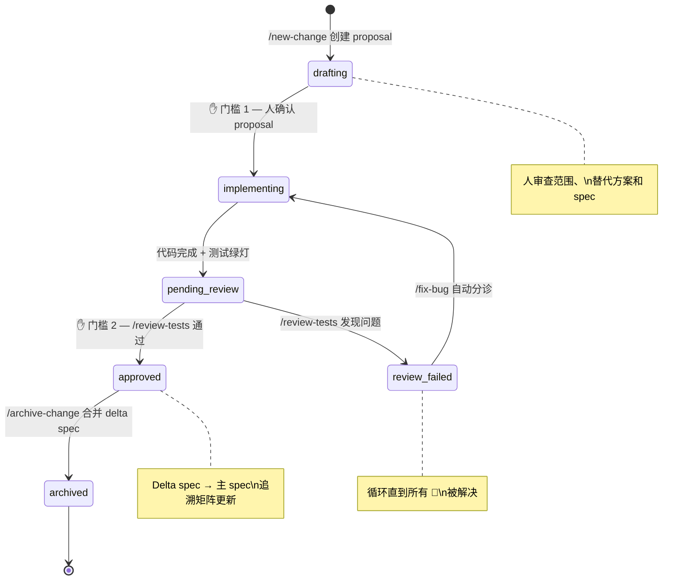
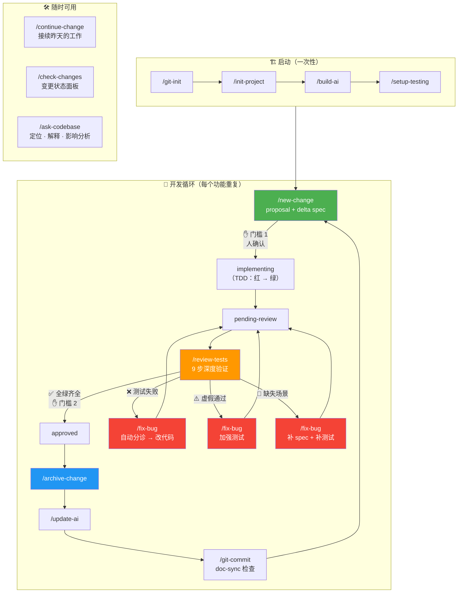
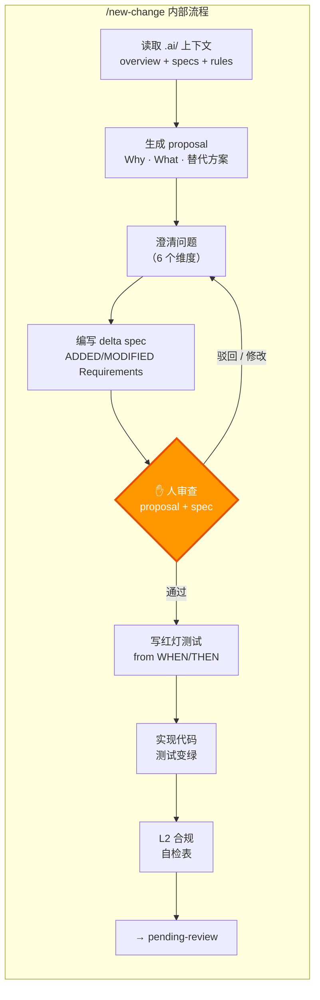
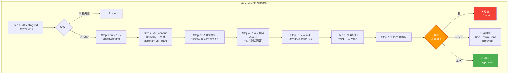

# Project Compass

> **[English Version](README.md)** · 版本见 [VERSION](VERSION) · [CHANGELOG](CHANGELOG.md)

> 通用 AI 上下文模板 — 适用于任意语言、任意框架、任意规模的项目
> 将本模板复制到你的项目根目录（重命名为 `.ai/`），按 `[填写]` 提示填入具体内容即可

## 核心理念

AI 的上下文窗口是有限的。对于任何有一定规模的代码库，都不可能把所有代码塞进上下文。
因此需要一套 **分层、按需加载** 的上下文管理体系，让 AI 每次对话都能：

1. **精准定位** — 收到任务时，知道该看哪些文件（功能→代码映射）
2. **遵守规则** — 知道该怎么写，不该怎么写（规则 + 反模式）
3. **理解目标** — 知道当前在做什么（需求规格层）
4. **延续进度** — 知道上一步做到哪了、下一步做什么（会话层）
5. **验证一致** — 检查实现是否符合 spec（追溯 + 测试设计）

### 设计原则

- **只写 AI 推导不出来的东西** — 目录结构、技术栈、模块职责这些 AI 能 `tree` + `grep` 推导，不值得写
- **面向任务的索引** — 文档的目标是帮 AI 定位"该看哪些代码"，而不是描述"代码长什么样"
- **关系 > 描述** — 文件间的耦合关系、变更联动比文件列表有用 100 倍
- **渐进式披露** — AI 每次只加载当前任务所需的最小上下文，而非一次性塞满窗口
- **可验证 > 抽象** — "Domain 层禁止 import Infrastructure 层"比"采用 Clean Architecture"有用

### L1 导航模型

AI 每次对话**只读 `overview.md`**（< 60 行），然后根据任务类型选择路径：

```
收到任务
 ├─ 匹配到具体功能 → features/[功能名]/README.md → 按需深入层文件
 ├─ 做常见开发任务 → key-files.md（通用任务食谱）
 ├─ 修改涉及多个模块 → module-map.md（变更联动表）
 └─ 改底层基础设施 → infrastructure/README.md
```

路径可组合 — 例如跨功能修改会同时加载 feature README + module-map。
每个目标文件都有**双向链接**（来源 / 相关文件），防止 AI 迷路。

## 五层架构

```
.ai/
├── L1-codebase-map/          ← 代码导航层（稳定，低频更新）
│   ├── overview.md           ← 唯一入口（< 60 行，功能索引 + 按需加载导航决策树）
│   ├── module-map.md         ← 模块合约与耦合地图（跨模块修改时加载）
│   ├── key-files.md          ← 通用任务食谱与调查起点（常见开发任务时加载）
│   ├── architecture.md       ← 运行时架构（部署拓扑、请求生命周期、中间件管道）
│   ├── infrastructure/       ← 基础设施文档（框架/中间件/构建流程/测试基础设施，与 features 平级）
│   │   ├── _infrastructure-template/ ← 基础设施组件文档模板
│   │   │   └── README.md        ← 组件概览 + 分层导航 + 格式参考
│   │   └── [component-name]/    ← 每个基础设施组件一个文件夹
│   │       ├── README.md        ← 组件概览（必读）
│   │       └── [层名].md        ← 层文件（按需加载）
│   └── features/             ← 按功能拆分的详细上下文（渐进式披露）
│       ├── _feature-template/   ← 功能文档模板（单文件，复制来创建新功能）
│       │   └── README.md        ← 概览 + 分层导航 + 数据流 + 层文件格式参考
│       └── [feature-name]/      ← 每个功能一个文件夹
│           ├── README.md        ← 功能概览（必读）
│           └── [层名].md        ← 层文件（按项目概念动态命名，按需加载）
│
├── L2-rules/                 ← 规则层（稳定，按领域分片）
│   ├── global.md             ← 全局规则（具体可执行规则 + 反模式清单）
│   ├── templates.md          ← 新建文件的代码模板（创建新文件时加载）
│   ├── _module-template.md   ← 模块规则模板（合约 + 陷阱 + 边界）
│   └── [module-name].md      ← 按项目实际模块创建
│
├── L3-specs/                 ← 需求规格与变更管理层（Spec-driven）
│   ├── specs/                ← 当前系统需求（分层结构：TOR → HLR）
│   │   ├── system.md         ← 系统级顶层需求（TOR）：系统边界 + 跨域约束
│   │   ├── _capability-template/ ← 能力域 spec 模板
│   │   └── <domain>/spec.md  ← 高层需求（HLR），每个能力域一个（可嵌套子能力域）
│   ├── changes/              ← 进行中的变更（文件系统即状态）
│   │   ├── _change-template/ ← 变更模板（proposal + delta spec + tasks）
│   │   └── <name>/           ← 每个变更一个文件夹
│   │       ├── proposal.md   ← 为什么 + 改什么 + 备选方案 + 决策理由
│   │       ├── specs/<cap>/spec.md ← 增量 spec（ADDED/MODIFIED/REMOVED）
│   │       └── tasks.md      ← 执行步骤（checkbox 格式）
│   └── archive/              ← 已完成变更（proposal.md 中记录 review 状态）
│
├── L4-session/               ← 会话层（高频变化，每次对话维护）
│   └── active-session.md     ← 当前会话状态（含测试状态 + 下一步动作）
│
├── L5-validation/            ← 验证层（spec 与代码的追溯 + 测试用例设计）
│   ├── validation-rules.md   ← 验证规则参考（AI 如何执行验证）
│   ├── traceability/         ← 追溯矩阵（spec ↔ 代码 ↔ 测试映射）
│   │   ├── _domain-template.md ← 追溯模板
│   │   └── <domain>.md       ← 每个能力域一个文件
│   ├── test-specs/           ← 测试用例设计（从 L3 Scenario 展开）
│   │   ├── _domain-template.md ← 测试用例模板
│   │   └── <domain>.md       ← 具体测试用例（输入/预期/边界情况）
│   └── reports/              ← 验证报告（带时间戳的快照）
│       └── <date>-<scope>.md ← 验证结果 + 缺口分析
│
├── builders/                  ← 自动生成文档的 Prompt 集合（按工具分目录）
│   ├── cline/               ← Cline 专用（subagent 只读，输出文本由主 agent 写入文件）
│   │   ├── sub-agent/        ← Sub-agent 变体（默认）：subagent 并行分析功能
│   │   │   ├── prompt-L1a.md ← 生成 L1 文档 Phase 1-3（扫描 + overview；基础设施优先）
│   │   │   ├── prompt-L1b.md ← 生成 L1 文档 Phase 4-5（4a 基础设施文档 → 4b subagent 功能深入分析）
│   │   │   ├── prompt-L2.md  ← 生成 L2 编码规则
│   │   │   ├── prompt-L3.md  ← 从已有代码构建 L3 初始 Spec
│   │   │   └── prompt-L5.md  ← 构建 L5 验证追溯和测试用例
│   │   └── single-agent/     ← 单 Agent 变体：不使用 subagent，每个功能/组件完成后暂停等人工审核
│   │       ├── README.md     ← 模式对比与使用指南
│   │       ├── prompt-L1a.md
│   │       ├── prompt-L1b.md ← 核心差异：主 agent 逐个分析功能和基础设施，每个暂停审核
│   │       ├── prompt-L2.md  ← 逐模块暂停审核
│   │       ├── prompt-L3.md
│   │       └── prompt-L5.md
│   └── claude/              ← Claude Code 专用（subagent 可读写，直接创建文件）
│       ├── prompt-L1a.md     ← 生成 L1 文档 Phase 1-3（扫描 + overview；基础设施优先）
│       ├── prompt-L1b.md     ← 生成 L1 文档 Phase 4-5（4a 基础设施文档 → 4b subagent 功能深入分析）
│       ├── prompt-L2.md
│       ├── prompt-L3.md      ← 从已有代码构建 L3 初始 Spec
│       └── prompt-L5.md      ← 构建 L5 验证追溯和测试用例
├── .github/skills/            ← Copilot 自定义技能（关键词触发自动调用）
│   ├── git-init/SKILL.md          ← 初始化新 git 仓库（关键词：init git、新仓库）
│   ├── init-project/SKILL.md      ← 从零搭建新项目（关键词：新项目、init project、从零开始）
│   ├── build-ai/SKILL.md          ← 从零构建 .ai 上下文（关键词：init .ai、构建 AI 上下文）
│   ├── update-ai/SKILL.md         ← 更新已有 .ai 上下文（关键词：刷新 .ai、更新 AI 文档）
│   ├── setup-testing/SKILL.md     ← 配置 / 更新测试规范（关键词：测试规范、testing rules）
│   ├── new-change/SKILL.md        ← Spec-driven 创建新变更（关键词：新需求、加功能、new feature）
│   ├── continue-change/SKILL.md   ← 接续上次未完成的变更（关键词：继续开发、continue）
│   ├── check-changes/SKILL.md     ← 查看所有变更状态（关键词：变更状态、进度、change status）
│   ├── review-tests/SKILL.md      ← 跑测试 + 覆盖审查 + 虚假通过狩猎（关键词：审查测试、虚假通过）
│   ├── fix-bug/SKILL.md           ← 统一修复入口，自动分诊根因（关键词：bug、修bug、review 打回、虚假通过）
│   ├── ask-codebase/SKILL.md      ← 代码库问答：定位功能、解释架构、影响分析（关键词：在哪、为什么、改了会影响什么）
│   ├── archive-change/SKILL.md    ← 归档已完成变更，合并 delta spec（关键词：归档、archive）
│   └── git-commit/SKILL.md        ← 生成 commit message + doc-sync 检查 + push（关键词：commit、提交）
├── entrypoints/              ← AI 工具入口文件模板
│   ├── clinerules.md         ← Cline 入口模板（→ .clinerules）
│   ├── claude.md             ← Claude Code 入口模板（→ CLAUDE.md）
│   ├── copilot-instructions.md ← GitHub Copilot 入口模板
│   ├── change-management.md  ← 变更管理流程参考（→ .ai/L3-specs/）
│   └── doc-sync.md           ← 文档同步流程参考（→ .ai/doc-sync.md）
├── roadmap/                  ← 路线图与调研
│   ├── README.md             ← 按级别整理的正式路线图
│   └── multi-agent-collaboration-research.md ← 多 Agent 并行协作调研
└── README.md                 ← 本文件
```

## L1 与 L2 的区别

> **一句话：L1 = 地图（在哪儿、怎么走），L2 = 规矩（怎么写、什么能做什么不能做）**

用一个比喻来说：
- **L1** = 城市地图 → "医院在这，学校在那，从家到医院走这条路"
- **L2** = 交通规则 → "靠右行驶，红灯停绿灯行，限速 60"

### 具体对比

| 问题 | L1 回答 | L2 回答 |
|------|---------|---------|
| "登录功能代码在哪？" | ✅ `src/auth/` 目录，入口在 `routes/auth.ts` | — |
| "改了 User 表会影响什么？" | ✅ 要同步改 JWTPayload 类型 | — |
| "请求的完整数据流是什么？" | ✅ route → controller → service → repo → 响应 | — |
| "命名应该用什么风格？" | — | ✅ 文件 kebab-case，函数 camelCase |
| "新建一个 Service 文件该长啥样？" | — | ✅ 有标准代码模板 |
| "错误处理该怎么做？" | — | ✅ Service 层 throw AppError，Controller 不 try-catch |
| "这个模块的 API 哪些能改？" | — | ✅ `authenticate()` 是 STABLE，`validatePassword()` 是 INTERNAL |
| "这个功能有什么坑？" | ✅ 异步回调有竞态条件 | — |

### 文件对应

```
L1 features/user-auth/              L2 rules/
├── README.md    → 数据流 + 变更影响     ├── global.md     → 全局编码规范
├── routes.md    → 端点在哪、参数结构     ├── templates.md  → 新建文件的代码模板
├── services.md  → 业务规则、状态流转     └── auth.md       → auth 模块的合约 + 编码约束
└── models.md    → 表结构、查询、迁移
     ↑                                      ↑
     地图：代码在哪、数据怎么流                规矩：代码怎么写、合约是什么
```

> 注：层文件名（如 routes.md、services.md）不是固定的，由 subagent 根据实际代码结构动态命名。

### 当信息同时跟两边有关时

| 信息类型 | 放哪 | 判断依据 |
|----------|------|----------|
| "登录时 token 刷新有竞态条件" | L1 | 跟该功能的数据流相关 |
| "`authenticate()` 是稳定 API，不能改签名" | L2 | 跟模块合约/编码约束相关 |
| "改了 User model 要同步改 DTO" | L1 | 是变更影响（改 A 要改 B） |
| "所有数据库操作必须使用事务" | L2 | 是编码规则（怎么写） |
| "支付回调是异步的" | L1 | 是数据流特性 |
| "新认证方式必须实现 AuthStrategy 接口" | L2 | 是编码约束（必须遵循的模式） |

## 快速开始

### 第一步：复制模板到项目

```bash
# 将整个 project-compass 复制到你的项目的 .ai/ 目录下
cp -r /path/to/project-compass /path/to/your-project/.ai/
```

### 第二步：用 builder prompt 依次构建 L1 → L2 → L3

选择与你 AI 工具匹配的 builder，**按顺序**执行 prompt：

- **Claude Code** → `builders/claude/`
- **Cline（sub-agent 模式）** → `builders/cline/sub-agent/` — subagent 并行分析功能，适合功能多的大项目
- **Cline（single-agent 模式）** → `builders/cline/single-agent/` — 主 agent 逐个分析，每项暂停等人工审核

| 顺序 | Builder Prompt | 构建内容 | 外部输入 |
|------|---------------|---------|----------|
| 1 | `prompt-L1a.md` | overview.md + 功能清单 + `_handoff.md` | 可选：补充上下文文件 |
| 2 | `prompt-L1b.md` | features/ 文档 + architecture.md + module-map.md + key-files.md | 读取步骤 1 的 `_handoff.md` |
| 3 | `prompt-L2.md` | global.md + templates.md + 模块规则 | 读取 L1 产出 |
| 4 | `prompt-L3.md` | system.md（TOR）+ 各能力域 spec（HLR） | 可选：PRD / 产品规格 / API 文档 |
| 5 | `prompt-L5.md` | 追溯矩阵 + 测试用例设计 + 验证报告 | 读取 L1 + L3 产出 |

> 每个 prompt 都是独立的完整指令。复制到 AI 新对话中，填入 `[占位符]`，让 AI 执行即可。

### 第三步：部署 entrypoint

将对应的 entrypoint 模板复制到项目根目录：

| AI 工具 | 来源 | 目标 |
|---------|------|------|
| Claude Code | `.ai/entrypoints/claude.md` | 项目根目录 `CLAUDE.md`（如已有 `CLAUDE.md`，将内容追加进去） |
| Cline | `.ai/entrypoints/clinerules.md` | 项目根目录 `.clinerules` |
| GitHub Copilot | `.ai/entrypoints/copilot-instructions.md` | `.github/copilot-instructions.md` |

完成后，每次 AI 对话都会自动加载 `.ai/` 上下文并自主导航。

## 加载策略

### 每次对话必加载（Prompt 前置）
- `L1-codebase-map/overview.md` — 轻量索引（< 60 行，功能目录 + 雷区）
- `L4-session/active-session.md` — 当前会话状态（含下一步动作）
- `L2-rules/global.md` — 全局规则（含反模式清单）

### 收到任务后按需加载（渐进式披露）
- `L1-codebase-map/features/[功能名]/README.md` — **从 overview.md 索引表匹配到功能后加载，按需深入各层文件**
- `L1-codebase-map/key-files.md` — 做通用开发任务时（加端点、加表、修 bug）
- `L1-codebase-map/module-map.md` — 跨模块修改时（查变更联动表）
- `L1-codebase-map/architecture.md` — 需要理解运行时行为、请求生命周期或排查跨层问题时
- `L2-rules/[module-name].md` — 处理特定模块任务时（查合约和陷阱）
- `L2-rules/templates.md` — 创建新文件时（查标准代码模板）
- `L3-specs/specs/system.md` — 查看系统级需求（TOR）
- `L3-specs/changes/` — 查看进行中的变更
- `L3-specs/change-management.md` — 创建或归档变更时（详细流程参考）
- `L5-validation/validation-rules.md` — 验证 spec 与代码一致性时
- `L5-validation/traceability/<domain>.md` — 检查实现覆盖率时
- `L5-validation/test-specs/<domain>.md` — 设计或生成测试时

### 偶尔参考
- `L3-specs/archive/` — 遇到“为什么这样做”的问题时（查 archive 中的 proposal.md）
- `L3-specs/specs/<domain>/spec.md` — 查看已有能力域的需求

## 实际工作流程（模式 B：AI 自主导航）

> 推荐用法：在项目根目录放一个入口文件，AI 每次对话自动读取 `.ai/` 下的文档，全程自主导航。

```
┌─────────────────────────────────────────────────────────┐
│  Step 0（一次性配置）                                      │
│  复制 entrypoints/ 下对应模板 → 项目根目录入口文件          │
│  （.clinerules / CLAUDE.md / copilot-instructions 等）    │
└─────────────────────────────────────────────────────────┘
                            ↓
┌─────────────────────────────────────────────────────────┐
│  Step 1-2（每次对话自动）                                  │
│  AI 读取入口文件 → 自动加载：                               │
│    • overview.md      — 项目功能索引                       │
│    • global.md        — 全局编码规则                       │
│    • active-session.md — 上次进度 + 下一步                  │
└─────────────────────────────────────────────────────────┘
                            ↓
┌─────────────────────────────────────────────────────────┐
│  Step 3  用户给出任务                                      │
│  "修复用户登录的 token 刷新 bug"                            │
└─────────────────────────────────────────────────────────┘
                            ↓
┌─────────────────────────────────────────────────────────┐
│  Step 4  AI 按索引定位功能                                  │
│  overview.md 功能索引 → 匹配"用户认证"                      │
│  → 读取 features/user-auth/README.md                     │
│  → 根据分层导航表按需深入各层文件                 │
└─────────────────────────────────────────────────────────┘
                            ↓
┌─────────────────────────────────────────────────────────┐
│  Step 5  AI 读取模块规则                                   │
│  → 读取 L2-rules/auth.md（合约 + 编码约束 + 陷阱）          │
└─────────────────────────────────────────────────────────┘
                            ↓
┌─────────────────────────────────────────────────────────┐
│  Step 6  AI 管理变更                                       │
│  → 查 changes/ 现有变更 / 创建 proposal + delta spec + tasks│
│  → 写执行计划 + 验收问题 → 等人类确认                        │
└─────────────────────────────────────────────────────────┘
                            ↓
┌─────────────────────────────────────────────────────────┐
│  Step 7  AI 执行编码                                       │
│  遵守 global.md + 模块规则，参考 templates.md               │
│  跨模块修改前查 module-map.md 变更联动表                      │
└─────────────────────────────────────────────────────────┘
                            ↓
┌─────────────────────────────────────────────────────────┐
│  Step 8  AI 更新会话状态                                    │
│  → 更新 active-session.md                                 │
│    • 完成了什么、涉及哪些文件                                │
│    • 测试结果、下一步具体动作                                │
└─────────────────────────────────────────────────────────┘
```

**关键点：** 人只需要做 Step 0（一次）+ Step 3（给任务），其余全部由 AI 自主完成。

## 每个文档该写什么（填写指南）

| 文档 | ✅ 该写 | ❌ 不该写（AI 自己能推导） |
|------|---------|--------------------------|
| overview.md | **功能索引表**（名称+指针）、**依赖关系概览**（功能→基础设施方向）、雷区、构建命令 | 数据流详情、涉及文件列表（放到 features/[name]/ 下） |
| module-map.md | **依赖拓扑**（ASCII 全局分层依赖图）、公开 API 清单、变更联动表、依赖禁止规则 | 模块职责描述、代码行数统计 |
| key-files.md | 通用任务食谱、调查起点、全局变更影响 | 功能相关的食谱（放到 features/[name]/ 下） |
| features/[name]/ | 单个功能的完整上下文，按层拆分：README（概览+数据流+**依赖的基础设施**）、controller/service/data（各层细节） | 跨功能的通用信息 |
| global.md | 具体可执行规则、反模式清单、错误处理模式 | "架构模式: Clean Architecture"（太抽象） |
| templates.md | 新建文件的代码模板（Service、Test 等） | 应从实际代码中提取，不是编造 |
| 模块规则 | 对外合约（函数签名+稳定性）、模块内编码约束、边界规则、测试策略 | 数据流、文件列表、变更影响（放 L1） |
| specs/system.md | 系统边界、跨域需求（TOR） | 功能级需求（放到对应能力域 spec） |
| specs/<domain>/spec.md | 能力域需求 + WHEN/THEN 场景（HLR） | 实现细节（放到变更的 tasks） |
| changes/<name>/ | proposal（为什么 + 决策）+ delta spec + tasks | — |
| archive/<name>/ | 已完成变更历史（proposal + spec + tasks） | — |
| traceability/<domain>.md | Spec → 代码 → 测试映射表，含状态（verified/untested 等） | 实现细节 |
| test-specs/<domain>.md | 具体测试用例（输入/预期/边界/异常），从 L3 Scenario 展开 | 框架相关语法 |
| active-session.md | 下一步具体动作、测试状态、涉及文件状态 | "正在做某功能"（太模糊） |

## 维护节奏

| 文档 | 谁维护 | 频率 |
|------|--------|------|
| L1 代码导航 | 人 + AI辅助 | 架构变更时 |
| L2 规则 | 人 | 规范变更时 |
| L3 需求规格 | 人审核 | 随变更归档累积 |
| L3 变更 | Agent 创建，人确认 | 每个变更周期 |
| L4 会话状态 | AI（人审核） | 每次对话结束时 |
| L5 验证 | AI 生成，人审核 | L3 构建后或变更归档后 |

## Skills — 自动触发的工作流

Project Compass 自带 **13 个 Copilot / Claude Code 自定义技能**（`.github/skills/`）。
见下方 [Skill 发现机制](#skill-发现机制-copilot--claude-code-怎么找到它们) 了解 AI 工具如何识别这些技能。

### 13 个 Skill

| 分类 | Skill | 何时用 |
|:-----|:------|:-------|
| **启动（4）** | `/git-init` | 初始化 git 仓库 |
| | `/init-project` | 从零建新项目 |
| | `/build-ai` | 已有代码，首次构建 `.ai/` |
| | `/setup-testing` | 配置 / 更新测试规范 |
| **开发（2）** | `/new-change` | 新功能 / 新需求 |
| | `/continue-change` | 接续昨天的工作 |
| **审核归档（3）** | `/review-tests` | 跑测试 + 覆盖审查 + **虚假通过狩猎** |
| | `/archive-change` | 归档已批准变更，并合并 delta spec |
| | `/check-changes` | 查看所有进行中变更 |
| **修复（1）** | `/fix-bug` | **统一修复入口**，自动分诊（代码/测试/spec 歧义/虚假通过） |
| **查询（1）** | `/ask-codebase` | 代码定位、架构解释、变更影响分析 |
| **文档发布（2）** | `/update-ai` | 代码改了后刷新 `.ai/` |
| | `/git-commit` | 提交 + doc-sync 检查 + push |

### 两个人工门槛（其余全部自动）

| 门槛 | 所在 Skill | 决策内容 |
|:-----|:-----------|:---------|
| **1. Proposal 确认** | `/new-change` | 业务：要不要做、怎么做 |
| **2. Review 批准** | `/review-tests` | 质量：测试够不够、有没有虚假通过 |

### Skill 驱动的完整工作流

#### 完整状态机



#### Skill 流转 — 完整开发周期



#### 门槛 1 — Proposal 确认（业务决策）



#### 门槛 2 — Review 批准（质量决策）



#### 各 Skill 步骤摘要

| Skill | 步骤数 | 关键检查点 |
|:------|:------|:-----------|
| `/new-change` | 8 步 | S1:读上下文 → S2:提案 → S3:澄清(6维度) → S4:Delta spec → **S5:✋门槛1** → S6:红灯测试 → S7:绿灯代码+L2检查 → S8:状态更新 |
| `/review-tests` | 9 步 | S0:跑测试 → S1:枚举场景 → S2:比对断言 → S3:调用链 → S4:7条反模式 → S5:反向推理 → S6:覆盖缺口 → **S7:✋门槛2** → S8:状态回流 |
| `/fix-bug` | 4 步 | S0:场景识别 → S1:找spec → S2:跑测试+Q1→Q6决策树 → S3:修复(A:代码/B:测试/C:spec) → S4:更新追溯 |
| `/archive-change` | 6 步 | S1:定位 → **S2:✋确认** → S3:合并delta → S4:更新追溯 → S5:移动归档 → S6:结构检查 |
| `/continue-change` | 8 步 | S1:找活跃变更 → S2:检查代码 → S3:读会话 → S4:读spec → S5:读任务 → S6:计划 → S7:注入L2规则 → S8:执行 |
| `/ask-codebase` | 4 步 | S1:分类(定位/解释/影响/规则/追溯) → S2:读.ai/文档 → S3:补充grep → S4:结构化回答 |

每个 skill 的内部 workflow + 虚假通过反模式清单，见 [WORKFLOW-ANALYSIS.md](WORKFLOW-ANALYSIS.md)。

## 集成方式

### 方式一：入口文件（推荐 — AI 自主导航）

从 `entrypoints/` 目录复制对应模板到项目根目录：

| AI 工具 | 模板文件 | 放置位置 |
|---------|----------|----------|
| Cline | `entrypoints/clinerules.md` | 项目根目录 `.clinerules` |
| Claude Code | `entrypoints/claude.md` | 项目根目录 `CLAUDE.md` |
| GitHub Copilot | `entrypoints/copilot-instructions.md` | `.github/copilot-instructions.md` |

入口文件包含完整的导航指令，AI 会自动读取 `.ai/` 下的文档并按需导航。
详见上方「实际工作流程（模式 B）」。
